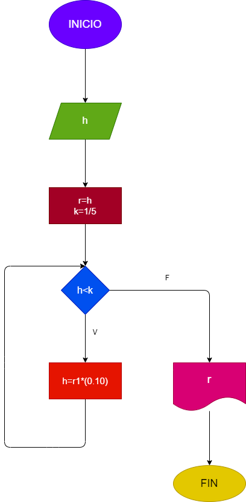

## Ejercicio #27: Una pelota se deja caer desde una altura h, y en cada rebote sube el 10% menos del anterior. Hacer el diagrama de flujo y programa en python, que lea h, y que calcule e imprima en cual rebote la pelota no alcanza a subir la quinta parte de la altura inicial.

# Diagrama de Flujo

